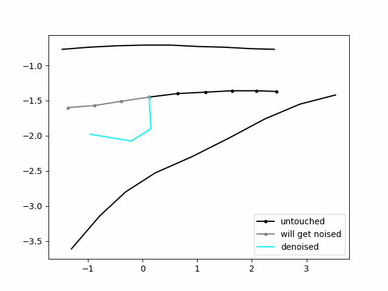

# Certified trajectory prediction

## Installation

To install the packages and libraries, type this command (you can create a conda venv if needed).
```
pip install -e .
```
To run the script on Windows : 
```
.\run_exp.bat 
```
on Linux, the scripts must be rewritten with .sh format

## Introduction 

This readme file will introduce the reader to the work I've done with my project. 

This project is about certified trajectory prediction. The goal is to find a certified model which is guaranteed to have bounded outputs given bounded input. If such a model exists, we are interested in knowing those bounds. <br>
In this work, we will focus on trying to apply this concept to a trajectory prediction model. This is very important for self-driving tasks, where having guarantees not to crash into an obstacle can be crucial. Particularly, we will use VITA's social-LSTM model [1] to predict the future from observation trajectories.

At first, I realized several experiments to look for a promising direction for this project. The experiments I've done are briefly introduced below and more information are provided in the corresponding .ipynb file. <br>
The final experiment, which is  my project's main topic, has its theory discussed in this readme and its implementation aspects in the jupyter file.

## Experiments (chronological)

### **Noise on observations** :

file: analyse/03_18_exp_noise/analyse_exp.ipynb

This experiment adds noise to the observation trajectory of **corrupted** scenes (with the s-attack method). We then analyse the resulting prediction, in terms of collision.<br>
Mind that during the whole project, we will always only add noise on the **last 3 timesteps** of the observation trajectories.

<p align="center">
    
</p>

### **Certification of trajectories** :

file: analyse/03_25_zero_col_certif/my_analyze.ipynb

This experiment has for goal to certify that a scene is collision-free. With a maximum noise level, we can certify that the "smoothed classifier" output will be "no collision" for a particular scene.

<p align="center">
    
</p>

### **fde/ade under noise** :

file: analyse/04_03_f_ade_zero_col_cert/analyse.ipynb

This experiment shows the effect on the final predicted trajectory when noise is added to the observation.

### **WRONG: Zero collision predictor** :

file: analyse/04_07_all_data/analyse.ipynb

This experiment is wrong and was later redone. It has for goal to predict a collision-free scene, even if the original predictions would have had a collision.

### **WRONG: Zero collision predictor v2** :

file: analyse/04_18_really_all_data_z_col_ade/analyse.ipynb

This experiment is wrong and was later redone. It has for goal to predict a collision-free scene, even if the original predictions would have had a collision.

### **Analyse of data, collision rate and ade/fde**

file: analyse/04_24_secret_v2/analyse_04_24.ipynb

Having seen that the 2 previous experiments did not showcase the correct numbers, I was wondering if something was wrong with the preprocessing of the scenes or the prediction pipeline. In this file, I tried to find those problems.

### **Analyse of data, IA crowd check**

file: analyse/04_25_no_noise_clean/analyse_04_25.ipynb

In this experiment, I am doing the last data check. I try many combination of preprocessing options, to see which one corresponds to the correct numbers. I also did an IA crowd submission to verify the numbers. In this file, I explain that there exists another definition for collision and that the number I was trying to get corresponds to a specific type of scene.

<p align="center">
    
</p>

### **RIGHT: Zero collision predictor v3** :

file: analyse/04_26_redo_0_col_pred/analyse_04_26.ipynb

Now that the correct way of handling NaN values is understood, we can repeat the experiment of the zero-predictor. It has for goal to predict a collision-free scene, even if the original predictions would have had a collision.

<p align="center">
    
</p>


### **Bounded trajectory regression** :

file : analyse/05_08_bounds/analyse_08_may.ipynb

This experiment is the main topic of my project. Given a maximal perturbation radius, we show that each coordinate of a predicted trajectory can be bounded. The theory behind this experiment is explained in the following section. 
We tested different types of functions to "summarize" the 100 noisy trajectories drawn: the mean and 2 types of medians. Finally, a diffusion denoiser was also implemented to reduce the variance of the noise added.

<p align="center">
    
    
</p>

### **Norm of noise before and after diffusion** :

file : analyse/06_08_noise/analyse_06_08.ipynb

To better understand the diffusion process, we wanted to see if the diffusion denoising process was really denoising the trajectory.

## Theory of **Bounded trajectory regression**

### Randomized smoothing 

The initial idea of randomized smoothing was initially designed for a classification problem and was presented in [2]. It consists of adding noise (of known $\sigma$) on an input and recording the prediction. By repeating this process with a Monte-Carlo sampling process, we could then establish guarantees on the prediction of the model, given the magnitude of the perturbation.

This idea was then modified to fit a regression problem in [3]. In this work, we will use the formulation of [4], which is equivalent.<br> 
Given a base regression function $f(x): \mathbb{R}^N \mapsto \mathbb{R}$, we define the smooth classifier g(x) being the expectation of f(x) under a certain noise level, as in (1). Then, (2) holds if we can find the bounds $l$ and $u$ for the regressor. Throughout, we use $\phi(x)$  to denote the
cumulative distribution function (CDF) of the standard Gaussian distribution.

<p align="center">
    
</p>

### Diffusion denoised smoothing

Diffusion-denoised smoothing is a technique that improves upon randomized smoothing. After the noising step, a diffusion denoising process is applied to the input, to reduce the overall variance and have better predictions. The idea behind this method is to drown the eventual adversarial perturbation into random noise, and then to denoise the signal to recover the original.

The noise distribution at each timestep in the probabilistic diffusion model is given by the scheduler $\alpha(t) = \alpha_t$. To match the desired noise level $\sigma$, one must first find the corresponding timestep $t^*$.

<p align="center">
    
</p>

Depending on the type of scheduler used, the time $t^*$ will have a different analytical solution.<br>
Once $\alpha_t$ is known, the input can be noised with :

<p align="center">
    
</p>

This will simulate a noisy sample at a time $t^*$ of a diffusion process. We can then naturally denoise it with the reverse diffusion process.

<p align="center">
    
</p>

Once those steps are done, one can proceed with the Monte Carlo sampling, to estimate $\mathop{\mathbb{E}}[f\circ h_{denoise}(x+\epsilon)],~ \epsilon \sim \mathcal{N}(0,\,\sigma^{2})$.

## Conclusion & future work

With the experiment **Bounded trajectory regression**, we saw that we can indeed obtain bounds, given a maximal input size. We demonstrated how the theory, initially thought for "certified object detection", can be extended to another regression problem: trajectory prediction. We then showed how this process could be improved with diffusion denoised smoothing, and how tighter the bounds are compared to just using the mean of the raw predictor.<br>
These bounds however are rather loose. Here are some ideas that could result in tightening those.

- Investigate diffusion. The diffusion denoising is applied to the velocity. Maybe directly applying it to the position could result in less numerical approximation (integration) and faster computation speed.

- Regarding the formula to compute the bounds, we were forced to choose really large prior bounds $l$ and $u$. One can easily see that this is not optimal, and I personally think that finding a way to tighten those, coordinate-wise, could lead to better results. 

- We chose to apply noise only on the last 3 timesteps. As the formula used expects noise on the whole input, our choice was more constrained. Thus, there should be a way to tighten the bounds, based on this fact.

- Another path to explore could be the Median Smoothing theory, introduced in [4]. They propose another formula, without the need of formulating the prior bounds $l$ and $u$.

There is still a lot to do, but this work contains an implementation basis and is a working proof-of-concept.


## Code 

This repo was originally cloned from the [s-attack repo](https://github.com/vita-epfl/s-attack).

Most of the code inside the *random_smooth* folder is inspired by the [smoothing repo](https://github.com/locuslab/smoothing) of locuslab.

For the diffusion part, I used the code of [MID repo](https://github.com/gutianpei/MID) and stiched some part together to acheive the denoising.

## Bibliography

[1] Alahi, A., Goel, K., Ramanathan, V., Robicquet, A., Fei-Fei, L., & Savarese, S. (2016). Social lstm: Human trajectory prediction in crowded spaces. In Proceedings of the IEEE conference on computer vision and pattern recognition (pp. 961-971).

[2] Cohen, J., Rosenfeld, E., & Kolter, Z. (2019, May). Certified adversarial robustness via randomized smoothing. In international conference on machine learning (pp. 1310-1320). PMLR.

[3] Salman, H., Li, J., Razenshteyn, I., Zhang, P., Zhang, H., Bubeck, S., & Yang, G. (2019). Provably robust deep learning via adversarially trained smoothed classifiers. Advances in Neural Information Processing Systems, 32.

[4] Chiang, P. Y., Curry, M., Abdelkader, A., Kumar, A., Dickerson, J., & Goldstein, T. (2020). Detection as regression: Certified object detection with median smoothing. Advances in Neural Information Processing Systems, 33, 1275-1286.

[5] Carlini, N., Tramer, F., & Kolter, J. Z. (2022). (Certified!!) Adversarial Robustness for Free!. arXiv preprint arXiv:2206.10550.

[6] Gu, T., Chen, G., Li, J., Lin, C., Rao, Y., Zhou, J., & Lu, J. (2022). Stochastic trajectory prediction via motion indeterminacy
 diffusion. In Proceedings of the IEEE/CVF Conference on Computer Vision and Pattern Recognition (pp. 17113-17122).


