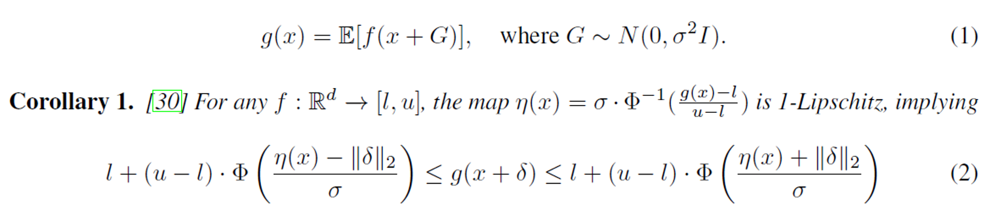

# Certified trajectory prediction

## Instalation (still need to check)

```
cd blabla...
pip install .
```
carefull pip install -e . doesnt work (dont allow relative import ???)

can run the the file from saeed + hossein : 
on windows
```
.\lrun.bat 
```
or on linux
```
bash lrun.sh
```

can run the experience with :
```
.\run_exp.bat
```

## Introduction 

This readme file will introduce the reader to the work I've done with my project. 

This project is about certified trajectory prediction. The goal is to find a certified model which is guaranteed to have bounded outputs given bounded input. If such a model exist, we are interested in knowing those bounds. <br>
In this work, we will focus on trying to apply this concept on a trajectory prediction model. This is very important for self-driving tasks, where having garantees not to crash into an obstacle can be crucial. Particularly, we will use the social LSTM model [1] to predict the future from observation trajectories.

At first, I've realized several experiement, to look for a promizing direction for this project. The experiments I've done will be briefly introduced here and more informations about those are contained in the coresponding .ipynb file. <br>
The final experiement, which is the main topic of my project, have its theory discussed in this readme and its implementation aspects in the jupyter file.

## Experiments (chronological)

### **Noise on observations** :

file: analyse/03_18_exp_noise/analyse_exp.ipynb

This experiments add noise on the observation trajectory of **corupted** scenes (with the s-attack method). We then analyse the resulting prediction, in terms of colision.

### **Certification of trajectories** :

file: analyse/03_25_zero_col_certif/my_analyze.ipynb

This experiment has for goal to certify that a scene is collision free. With a maximum noise level, we can certify that the output of the "smoothed classifier" will be "no collision", for a particular scene.

### **Fde/ade under noise** :

file: analyse/04_03_f_ade_zero_col_cert/analyse.ipynb

This experiments shows the effect on the final predicted trajectory when noise is added on the observation.

### **WRONG : Zero colision predictor** :

file: analyse/04_07_all_data/analyse.ipynb

This experiment is wrong and was latter redone. It has for goal to predict a colision-free scene, even if the original preditions would have had a colision.


### **WRONG : Zero colision predictor v2** :

file: analyse/04_18_really_all_data_z_col_ade/analyse.ipynb

This experiment is wrong and was latter redone. It has for goal to predict a colision-free scene, even if the original preditions would have had a colision.

### **Analyse of data, colision rate and ade/fde**

file: analyse/04_24_secret_v2/analyse_04_24.ipynb

Having seen that the 2 previous experiements did not showcase the correct numbers, I was wondering if something was wrong with the preprocessing of the scenes or the prediction pipeline. In this file, I tried to find those problems.

### **Analyse of data, IA crowd check**

file: analyse/04_25_no_noise_clean/analyse_04_25.ipynb

In this experiment, I am doing the last data check. I try many combinaison of preprocessing options, to see wich one coresponds to the correct numbers. I also did on IA crowd submission to verify the numbers. In this file, I explain that there exists another definition for colision, and that the number I was trying to get corespond to a specific type of scenes.

### **RIGHT : Zero colision predictor v3** :

file : analyse/04_26_redo_0_col_pred/analyse_04_26.ipynb

Now that the corect way of handling NaN values is understood, we can repeat the experiment of the zero-predictor. It has for goal to predict a colision-free scene, even if the original preditions would have had a colision.

### ** Bounded trajectory regression ** :

file : analyse/05_08_bounds/analyse_08_may.ipynb

This experimement is the main topic of my project. Given a maximal perturbation radius, we show that each coordinate of a predicted trajectory can be bounded. The theory behind this experiement is explained in the following section. 
We tested different type of functions to "sumarize" the 100 noisy trajectories drawn: the mean and 2 type of median. Finally, a diffusion denoiser was also implemented to reduce the variance of the noise added.

## Theory of **Bounded trajectory regression**

### Randomized smoothing 

The initial idea of randomized smoothing was initially design for a classification problem, and was presented in [2]. It consists of adding noise (of known $\sigma$) on an input and recording the prediction. By repeating this process with a Monte-Carlo sampling process, we could then establish garantees on the prediction of the model, given the magnitude of the perburbation.

This idea was then modified to fit a regression problem in [3]. In this work, we will use the formulation of [4], which is equivalent.<br> 
Given a base regression function $f(x): \mathbb{R}^N \mapsto \mathbb{R}$, we define the smooth classifier g(x) being the expectation of f(x) under a certain noise level, as in (1). Then, (2) holds if we can find the bounds $l$ and $u$ for the regressor. Throughout, we use $\phi(x)$  to denote the
cumulative distribution function (CDF) of the standard Guassian distribution.



### Diffusion denoised smoothing

Diffusion denoised smoothing is a technique that improoves upon randomized smoothing. After the noising step, a diffusion denoising process is applied on the input, to reduce the overall variance and have better predictions. The idea behind this method, is to drown the eventual adversarial perturbation into random, and then to denoise the signal to recover the original.

The noise distribution at each timestep in probabilistic diffusion model is given by the scheduler $\alpha(t) = \alpha_t$. To match the desired noise level $\sigma$, one must first find the coresponding timestep $t^*$.

<p align="center">
    
</p>

Depending on the type of scheduler used, the time $t^*$ will have a different analytical solution.<br>
Once $\alpha_t$ is known, the input can be noised with :

<p align="center">
    
</p>

This will simulate a noisy sample at a time $t^*$ of a diffusion process. We can then naturally denoise it with the reverse diffusion process.

<p align="center">
    
</p>

Once those step is done, one can proceed with the Monte Carlo sampling, to estimate $\mathop{\mathbb{E}}[f\circ h_{denoise}(x+\epsilon)],~ \epsilon \sim \mathcal{N}(0,\,\sigma^{2})$.


## Code 

cite 6 + git, github of cohen
cite sattack


<!-- <p align="center">
    
</p> -->


## Bibliography

[1] Alahi, A., Goel, K., Ramanathan, V., Robicquet, A., Fei-Fei, L., & Savarese, S. (2016). Social lstm: Human trajectory prediction in crowded spaces. In Proceedings of the IEEE conference on computer vision and pattern recognition (pp. 961-971).

[2] Cohen, J., Rosenfeld, E., & Kolter, Z. (2019, May). Certified adversarial robustness via randomized smoothing. In international conference on machine learning (pp. 1310-1320). PMLR.

[3] Salman, H., Li, J., Razenshteyn, I., Zhang, P., Zhang, H., Bubeck, S., & Yang, G. (2019). Provably robust deep learning via adversarially trained smoothed classifiers. Advances in Neural Information Processing Systems, 32.

[4] Chiang, P. Y., Curry, M., Abdelkader, A., Kumar, A., Dickerson, J., & Goldstein, T. (2020). Detection as regression: Certified object detection with median smoothing. Advances in Neural Information Processing Systems, 33, 1275-1286.

[5] Carlini, N., Tramer, F., & Kolter, J. Z. (2022). (Certified!!) Adversarial Robustness for Free!. arXiv preprint arXiv:2206.10550.

[6] Gu, T., Chen, G., Li, J., Lin, C., Rao, Y., Zhou, J., & Lu, J. (2022). Stochastic trajectory prediction via motion indeterminacy
 diffusion. In Proceedings of the IEEE/CVF Conference on Computer Vision and Pattern Recognition (pp. 17113-17122).


